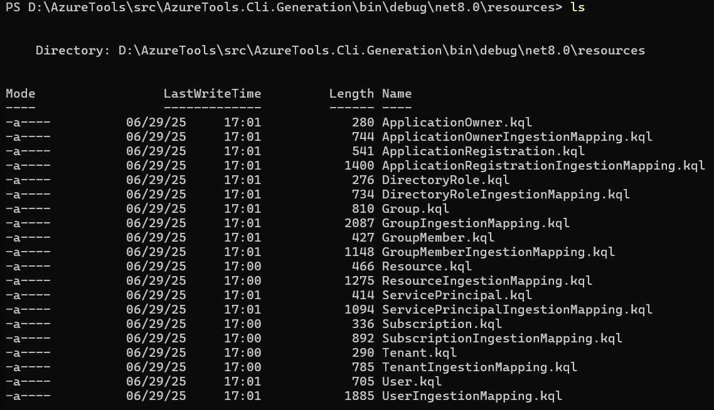

# AzureTools
This is a collection of tools that will help someone who is looking for more information on their Azure environment
... or someone else's. 

## Project Overview
This project is the baseline for other toolkits that could make integrating Azure information with other security tools, for completing inventories, or for doing recon post-exploitation. 

## Current Problems
Password automation is not fully supported to write to a vault.
IDataReader serialization to a class needs to be rethought due to the way backing classes are implemented. For example, PasswordCredential objects might come back as JObjects.
Configuration-based filtering for Azure object properties needs to be implemented correctly. 
Custom password credential expiration needs to be implemented.

## Future Improvements
- CLI tools to get information about target tenants. 
- Automation tools.

## Requirements
- Run the kafka docker container locally and add the required topics. A really good tool is here: https://developer.confluent.io/confluent-tutorials/kafka-on-docker/
- To implement the Kusto-based automations, one must have an Azure subscription and a kusto cluster with the correct schema. The schema can be automatically generated by calling 'api/GenerateGraphKustoTables' and 'api/GenerateGraphKustoTableMappings'

# Current Automated Processes
## AzureTools.Automation
This is an Azure Function that collects data about a target Azure tenant and persists it in a data store. The only data sinks that are currently supported are local file and Kusto, although it is not configured dynamically at the moment. Filtering by certain properties will be implemented in a future iteration so that one can collect the information that is consistent with their permissions.  

## AzureTools.Automation.Secrets
This is an Azure Function that gets information about expiring password credentials on Application Registrations and updates them with a new version. A versioning system is based on the display name of the password credential plus the unix timestamp (milliseconds) of the creation time of the password credential. This allows the automation to track existing and new versions of password credentials on the same application registraiton.

# CLI Tools
The CLI toolset is, at the moment, quite basic. Below is a rundown of what one can expect as of the current iteration. 

## AzureTools.Cli
This is a console application that allows one to interact with ARM APIs. There is currently no configuration, so it only performs the basic request. One would require at least Reader RBAC roles on a Subscription or Management Group to use this. It is currently in 'alpha' stage and is more a quick debugging/dev tool for ARM APIs than anything else. This will be expanded further to support other features.

### Usage
This tool uses the `System.CommandLine` package to accept arguments and execute requests. Basic help can be obtained by using the `--help` parameter.
```cmd
.\AzureTools.Cli.exe --help
Description:
  AzureTools Cli

Usage:
  AzureTools.Cli [command] [options]

Options:
  -?, -h, --help  Show help and usage information
  --version       Show version information

Commands:
  list  Lists the results for the given option.
```
#### List SubCommands
Only Azure Resource Manager requests are supported by the `list` command at the moment.
```cmd
.\AzureTools.Cli.exe list --help
Description:
  Lists the results for the given option.

Usage:
  AzureTools.Cli list [command] [options]

Options:
  -?, -h, --help  Show help and usage information

Commands:
  tenants              List all tenants
  subscriptions        List all subscriptions
  resources            List all resources in a subscription
  resource-properties  List properties of a specific resource
```
##### Tenants
This lists all of the tenants the principal has access to and prints a basic representation on the screen. The principal's access to a tenant will determine the output. See the examples below.

App Registration with no specific access.
```cmd
.\AzureTools.Cli.exe list tenants
Tenant information:  (/tenants/********-****-****-****-************) -  - Home -  -
```
User with administrative permissions on the tenant
```cmd
.\AzureTools.Cli.exe list tenants
Tenant information: Default Directory (/tenants/********-****-****-****-************) - US - Home - ******.onmicrosoft.com - AAD
```
##### Subscriptions
This lists the subscriptions the principal has access to. If there is nothing returned, the tool reports nothing found. 
```cmd
.\AzureTools.Cli.exe list subscriptions
No subscriptions found.
```
```cmd
.\AzureTools.Cli.exe list subscriptions
Subscription information: Subscription: Sub Display Name (********-****-****-****-************), State: Enabled, Tenant: ********-****-****-****-************
```
##### Resources
Lists the resources in the subscription. 
```cmd
.\AzureTools.Cli.exe list resources --subscriptionid ********-****-****-****-************
Resource information: Name: dataoutput, Type: Microsoft.Kusto/clusters, Id: /subscriptions/********-****-****-****-************/resourceGroups/Kusto/providers/Microsoft.Kusto/clusters/dataoutput
```
##### Resource
Gets the details for a specific resource, using the Resource ID. 
<br>
*Note:* This might not work consistently at the present time due to lack of dynamic API version resolution.
```cmd
.\AzureTools.Cli.exe list  resource-properties --resourceid /subscriptions/********-****-****-****-************/resourceGroups/Kusto/providers/Microsoft.Kusto/clusters/dataoutput
```

## AzureTools.Cli.Generation
This is a console application that allows one to generate Kusto table and ingestion mapping scripts for the ARM and Graph object classes in `AzureTools.Client` library. See the `resources` directory where the tool was executed for the output.
### Usage
This tool uses the `System.CommandLine` package to accept arguments and execute requests. Basic help can be obtained by using the `--help` parameter.
```cmd
.\AzureTools.Cli.Generation.exe --help
Description:
  AzureTools Cli

Usage:
  AzureTools.Cli.Generation [command] [options]

Options:
  -?, -h, --help  Show help and usage information
  --version       Show version information

Commands:
  generate  Lists the results for the given option.
```

#### Generate ARM Kusto Scripts
```cmd
.\AzureTools.Cli.Generation.exe generate kusto arm
Generating ARM Kusto scripts.
Generated Kusto Table Create Scripts in directory D:\AzureTools\src\AzureTools.Cli.Generation\bin\debug\net8.0\resources
Generated Kusto Table Ingestion Mapping Scripts in directory D:\AzureTools\src\AzureTools.Cli.Generation\bin\debug\net8.0\resources
```

#### Generate Graph Kusto Scripts
```cmd
.\AzureTools.Cli.Generation.exe generate kusto graph
Generating Graph Kusto scripts.
Generated Kusto Table Create Scripts in directory D:\AzureTools\src\AzureTools.Cli.Generation\bin\debug\net8.0\resources
Generated Kusto Table ingestion mapping Scripts in directory D:\AzureTools\src\AzureTools.Cli.Generation\bin\debug\net8.0\resources
```
